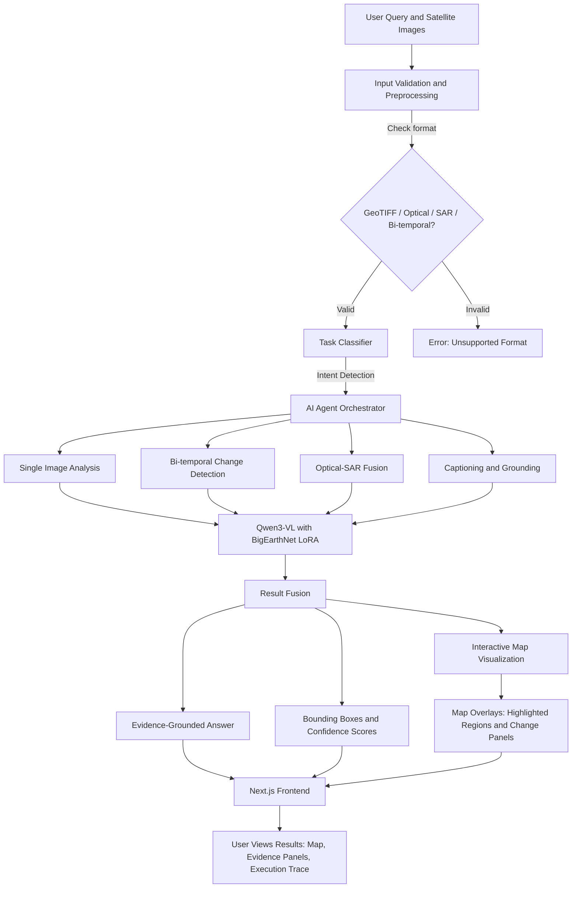

🚀 SatQuery AI
Interactive Vision-Language Assistant for Multimodal Remote Sensing Image Analysis
Smart India Hackathon 2026 | Problem Statement ID: 26167  
Organization: Indian Space Research Organisation (ISRO)
Team: Certified Bug Hunters
Theme: Space Technology | Category: Software

🌍 Overview
SatQuery AI is a cutting-edge vision-language agent for satellite imagery analysis. It allows natural-language queries on remote sensing data and returns evidence-grounded answers with bounding boxes, confidence scores, and interactive map visualization.

With the new Next.js frontend + live map integration, users can:

Upload satellite imagery (GeoTIFF / Optical / SAR / Bi-temporal)

Interactively explore results on a Leaflet/Mapbox-powered map

View bounding boxes, overlays, and change detection directly on the map

Get auditable execution summaries for every query

🏗 Architecture 

🛠 Tech Stack
Layer	Technology
Frontend	Next.js 13 + Tailwind CSS + shadcn/ui + Leaflet/Mapbox
Backend	FastAPI (Python)
Core VLM	Qwen3-VL-4B-Instruct + BigEarthNet LoRA
Orchestration	Rule-based Task Classifier + Agentic Router
Geospatial	rasterio + GeoTIFF utilities
Visualization	Multi-region bounding boxes + Interactive Map

⚡ Capabilities (MVP)
✅ Single-image Visual Question Answering (VQA)

✅ Image Captioning & Scene Description

✅ Text-guided Multi-region Grounding (Water / Built-up / Vegetation)

✅ Bi-temporal Change Detection + Change Description

✅ Optical + SAR Cross-modal Analysis

✅ Agentic Orchestration with Execution Trace

✅ Interactive Map Visualization (Leaflet/Mapbox)

🚀 Quick Start
Backend Setup
bash
python -m venv venv
source venv/bin/activate   # Windows: venv\Scripts\activate
pip install -r requirements.txt
python -m uvicorn api:app --host 0.0.0.0 --port 8000 --reload
Frontend Setup
bash
cd SatQuery_frontend
npm install
npm run dev
Frontend → http://localhost:3000

Backend → http://localhost:8000

🔧 Environment Variables
env
SATQUERY_USE_HF=1
SATQUERY_HF_MODEL_ID=Qwen/Qwen3-VL-4B-Instruct
SATQUERY_LORA_ADAPTER=weights/bigearthnet_lora
SATQUERY_LOAD_4BIT=1
📂 Supported File Formats
Format	Supported	Notes
PNG / JPG / JPEG	Yes	Standard RGB images
GeoTIFF (.tif)	Yes	Full geospatial metadata
SAR Images	Yes	Optical + SAR cross-analysis

💡 Example Queries
Detect water bodies

Identify built-up and water regions

Highlight vegetation

Compare two images and show changes

Describe this satellite image

🏆 Mandatory PS Coverage
Requirement	Status
Single-image VQA	✅
Captioning / Grounding	✅
Bi-temporal Change Analysis	✅
Optical + SAR Cross-modal	✅
Agentic Model / Pipeline Selection	✅
Input Validation	✅
Evidence + Confidence + Summary	✅
Remote-sensing adaptation	✅
Interactive Map Visualization	✅

🌟 Key Innovations
Agentic Orchestration → Auto-routing to correct pipeline

Multimodal Support → Single, Bi-temporal, Optical + SAR

Remote Sensing Adaptation → BigEarthNet fine-tuning

Evidence-Grounded Output → Bounding boxes + Confidence

Interactive Map → Visual overlays for user queries

Auditable Execution → Transparent trace for every query

📁 Project Structure
bash
satquery_ai/
├── api.py                # FastAPI entry point
├── src/
│   ├── agent/
│   │   ├── orchestrator.py
│   │   └── task_classifier.py
│   ├── analysis/
│   │   ├── single_image.py
│   │   ├── change_detection.py
│   │   ├── optical_sar.py
│   │   └── fusion.py
│   ├── models/
│   │   └── vlm_wrapper.py
│   └── utils/
│       ├── validation.py
│       ├── visualization.py
│       └── geotiff_utils.py
└── weights/
    └── bigearthnet_lora/
SatQuery_frontend/
├── pages/                # Next.js routes
├── components/           # UI + Map components
├── lib/                  # API integration
└── public/               # Static assets
🎯 Impact Statement
SatQuery AI combines AI + Geospatial Intelligence to deliver actionable insights for:

🌊 Disaster Management → Flood/landslide change detection

🌱 Agriculture Monitoring → Vegetation health tracking

🏙 Urban Planning → Built-up area growth analysis

🌳 Environmental Monitoring → Deforestation detection

With interactive maps + evidence-grounded outputs, SatQuery AI sets a benchmark for next-gen space technology solutions.
